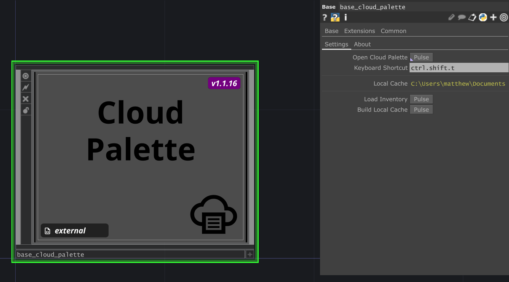
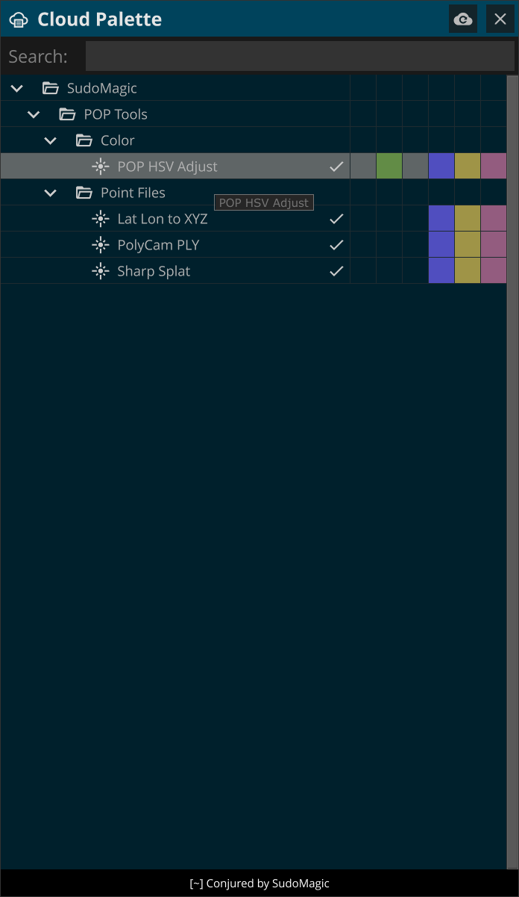

# TD Cloud Palette

## Summary

Cloud Palette presents a collection of components and examples that you can pull to integrate into your project without needing to host them locally. The view of available components here is a representation of assets that are available from the cloud. Rather than storing elements locally on your machine, Cloud Palette's idea is that you want the ease of use to pull components from the cloud. No component represented in the tree view of Cloud Palette is local, instead, pulling a comp loads it dynamically from the web - making this ideal for quickly loading elements from the web without needing a complete store locally.

## Invio

Organizing TOX files is something we've long fought with - keep them in your base repo and they get out of date. Organize them in a submodule and then you need a git strategy to keep the synced. Put them in dropbox and then you need dropbox installed on every machine. It's never been the kind of workflow we've wanted. Invio stands on a git automation that builds out TOXs to file and generates an inventory. You create a Cloud Palette Inventory with Invio which then allows you to pull TOX files directly from the cloud - always the latest, no other apps needed. Invio allows for simple structuring on your collections which generates a `json` file that's consumed by the Cloud Palette Component. We use Invio to create a collection that we want to use with Cloud Palette.

[invio.sudo.codes](https://invio.sudo.codes/)

## TDM Installation

If you are using the [TouchDesigner Dependency Manager](https://github.com/SudoMagicCode/TouchDesigner-Dependency-Manager) you can add this component to your local project with a `add package` command.

```shell
tdm add package github.com/SudoMagicCode/td-cloud-palette
```

## Cloud Palette Compatible Repos

There are several repos available on github that contain collections that can be easily added to Cloud Palette. Below is a collection of the resources that you can add easily to Cloud Palette.

Name | Access | Description |
--- | --- | --- |
[SM TD Templates](https://github.com/SudoMagicCode/sm-td-templates) | 🌎 Public | A collection of starting points for networks |
[SM TD Tools](https://github.com/SudoMagicCode/sm-td-tools) | 🌎 Public | A collection of drop in tools |
[SM POP Tools](https://github.com/SudoMagicCode/sm-td-pop-tools) | 🌎 Public | A collection of POP helpers |
[SM Instancing Examples](https://github.com/SudoMagicCode/sm-td-instancing-examples) | 🌎 Public | A collection of instancing examples |

## Using Cloud Palette in TouchDesigner

Cloud Palette allows for remote access of both TOX and template networks directly from the internet. This means that you do not need to download anything, and no data is stored by the Cloud Palette TOX. Instead when you pick something from the interface it grabs it from an existing location out on the internet. Optionally, you can create a local cache of files for faster loading or for working when you don't have an internet connection.

### Installation & Adding to your Project

If you're manually installing Cloud Palette use the following steps:

* download the `package.zip` file from the [latest release](https://github.com/SudoMagicCode/td-cloud-palette/releases/latest)
* unzip the file and local the `Cloud Palette` directory, inside of this directory you'll find the `Cloud Palette.tox` file that you drag and drop into your TouchDesigner project

### Opening the UI

The Cloud Palette TOX has a parameter that you can use to open interface. You can use the parameter `Open Cloud Palette` or you can assign a keyboard shortcut to open the palette. By default this is set to `ctrl + shift + t`



### Loading an Inventory

Remote assets are described by a `json` file that's used to load remote assets. You can find an example inventory in this repo called `cloudPaletteInventory.json`. Use the `Load Inventory` pulse parameter on the Cloud Palette TOX to load this file.

### The Cloud Palette Interface

The Cloud Palette interface features a set of nested folders allowing for structured organization of remote assets. There's also a color swatch indicator to help determine which operator families are used in the remote TOX. A checkmark in the UI indicates if the remote TOX has be saved with the same version of TouchDesigner as you are currently using.



Clicking on a row in Cloud Palette downloads the remote TOX and loads it into TouchDesigner just like using the Op Create Dialog.
